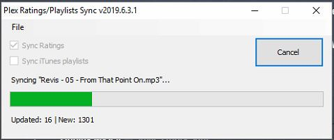

**Project Description**

Sync ratings from music files to plex, and syncs playlists (including smart playlists) from an iTunes library to plex.

This little utility can be scheduled to run on a Windows Plex server. The utility can sync ratings from files into plex, and also sync playlists (including smart playlists) from an iTunes library file into plex.

You can schedule this app to run on a regular basis using Windows Task Scheduler.

Options...

**Fork changes**

This fork lets you choose to sync independently ratings OR playlists.
The rating sync feature is not limited to iTunes, it syncs the file rating tag of the file directly.

